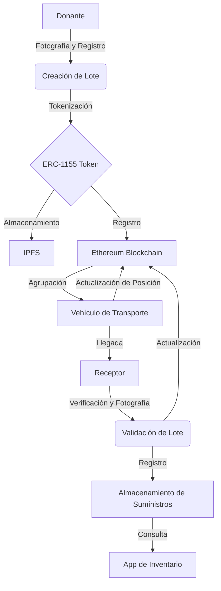

# pfm-web3-nov24-2
### Proyecto Fin de Máster: Sistema de Trazabilidad de Donaciones con Blockchain para la DANA en Valencia

#### Introducción

La transparencia y confiabilidad en la gestión de donaciones son fundamentales en situaciones de emergencia. En este contexto, la tecnología blockchain ofrece un marco inmutable, verificable y transparente para la trazabilidad de bienes y servicios. Este proyecto plantea el desarrollo de un sistema de trazabilidad en blockchain para gestionar donaciones destinadas a ayudar a los afectados por la DANA en Valencia. A través de un flujo de validación en cadena de bloques, se garantiza la integridad y seguimiento de los bienes donados, desde el donante hasta su destino final, permitiendo a los donantes comprobar de forma clara cómo y dónde se emplea su aportación.

Este proyecto se presenta como una Prueba de Concepto (PoC) en la que se define un flujo de trazabilidad acotado y modular para facilitar futuras ampliaciones.

---

### Objetivos

1. **Desarrollar un sistema de trazabilidad de donaciones** que permita a los donantes conocer el estado de su aportación en tiempo real y a través de un código QR, promoviendo la transparencia.
2. **Implementar una solución de gestión de donaciones en blockchain** que registre cada paso del proceso de transporte, clasificación y distribución, asegurando la integridad y transparencia de los datos.
3. **Validar la PoC en un entorno controlado** con los pasos definidos para evaluar su eficacia y potencial escalabilidad en situaciones de emergencia.

---

### Descripción del Proyecto

#### Cadena de Pasos de la Trazabilidad

El sistema de trazabilidad propuesto para esta ONG ficticia de ayuda para la DANA en Valencia consta de varios pasos detallados a continuación:

1. **Donación de Producto y registor de productos**: 
    - El donante selecciona uno o varios tipos de productos de un listado definido (comida, productos de limpieza y herramientas).
    - Tras seleccionar la cantidad de productos que desea donar se simularia la entrega en un lugar de recogida, el personal verifica la entrega y genera un código QR que identifica la donación y el tipo de productos. Este QR permite al donante realizar un seguimiento de su donación a lo largo del proceso.
    - Una vez entregados y validados, los productos se agrupan en lotes de entre 3 y 10 unidades para facilitar su transporte y gestión.

3. **Agrupación en Lotes**:
    - Se generan lotes de entre 3 y 10 donaciones individuales en el mismo punto de recogida.
    - Cada lote es registrado en blockchain con un QR específico, que contendrá información detallada de los productos incluidos y el lugar de recogida.
    
4. **Transporte a Valencia**:
    - Cada lote es asignado a un conductor, quien valida los productos del lote escaneando el QR y registrando el movimiento en la blockchain. Este paso asegura que todos los productos correspondientes al lote se mantienen intactos durante el transporte.
    - La validación de este paso activa el siguiente evento en la blockchain, notificando su envío.

5. **Recepción y Distribución**:
    - El lote es recibido en Valencia en un único centro de distribución (por simplicidad del alcance).
    - El receptor verifica la información del QR y registra en blockchain la validación de que el lote entregado coincide con el lote esperado.
    - Este lote se destina directamente a una de las áreas de distribución designadas: Paiporta, Chiva, Massanassa o Catarroja.
    
Cada paso del proceso queda registrado en la blockchain, permitiendo que el donante, al escanear su QR, consulte la trayectoria de su donación y conozca el destino final de su contribución.

---

### Alcance y Limitaciones

- **Divisibilidad**: Las donaciones individuales no son divisibles y se identifican con un único QR al ser registradas por primera vez.
- **Lotes de Productos**: Los productos se agrupan en lotes de entre 3 y 10 unidades. Cada lote se mueve conjuntamente al siguiente paso sin separarse.
- **Productos Aceptados**: Los productos aceptados en esta PoC son tres categorías: comida, productos de limpieza y herramientas.
- **Puntos de Recogida**: El alcance está limitado a dos puntos de recogida en total Madrid y Barcelona, para simplificar la PoC.
- **Transporte**: Se asume que el transporte tiene capacidad ilimitada, por lo que no se especifican detalles de la compañía de transporte ni limitaciones de carga.
- **Áreas de Distribución**: Las zonas de distribución final se limitan a tres localidades específicas en la Comunidad Valenciana: Paiporta, Chiva, Massanassa y Catarroja.
- **Eventos en Blockchain**: Para garantizar la validación de cada paso, se utilizarán eventos que se activan desde el contrato inteligente para indicar la finalización de una etapa y la disponibilidad de la siguiente.


---

### Desarrollo e Implementación Técnica

1. **Registro de Productos**: Captura y almacenamiento de fotografías de los productos donados en cada lote.
2. **Tokenización de Lotes**: Creación de tokens únicos para cada lote de donaciones.
3. **Trazabilidad de Transporte**: Seguimiento en tiempo real del transporte de lotes desde el punto A al punto B.
4. **Validación de Recepción**: Verificación y registro fotográfico de los lotes recibidos en el destino.
5. **Gestión de Inventario**: Registro y consulta del almacenamiento de suministros.

## Arquitectura Técnica

### Blockchain
- Red: Ethereum (pública)
- Contratos Inteligentes: Solidity (Foundry)

### Estándar de Token
Para este proyecto podemos utilizar el estándar ERC-1155. Este estándar permite la creación de tokens tanto fungibles como no fungibles, lo que es ideal para representar lotes de productos que pueden tener características únicas pero también ser parte de una categoría más amplia.

### Almacenamiento de Datos
- IPFS (InterPlanetary File System) para almacenar fotografías y metadatos extensos.

### Frontend
- Aplicación web/móvil para interactuar con los contratos inteligentes y visualizar la trazabilidad.

## Flujo del Proceso

1. **Registro de Donación**:
   - El donante entrega los productos.
   - La ONG fotografía los productos.
   - Se crea un lote y se tokeniza (ERC-1155).
   - La información se almacena en IPFS y se registra en la blockchain.

2. **Preparación para el Transporte**:
   - Se agrupan los lotes en un vehículo.
   - Se inicia el seguimiento del transporte.

3. **Trazabilidad en Ruta**:
   - El vehículo actualiza su posición periódicamente en la blockchain.

4. **Recepción en Destino**:
   - El receptor verifica y fotografía los lotes recibidos.
   - Se actualiza el estado del token en la blockchain.

5. **Almacenamiento**:
   - Se registra la ubicación de almacenamiento de los suministros.

6. **Consulta de Inventario**:
   - Los usuarios autorizados pueden consultar el inventario a través de la aplicación.

## Diagrama de Flujo



---

### Pruebas y Validación

instala foundryup. Sigue las instrucciones en https://book.getfoundry.sh/getting-started/installation.
```
curl -L https://foundry.paradigm.xyz | bash
```
arranca foundry en la carpeta back:
```
forge init back
```
instalar el token de openzeppelin:
```
forge install OpenZeppelin/openzeppelin-contracts
```
Compila el contrato y ejecuta las pruebas:
```
forge build
forge test
```

Ejecuta anvil para lanzar un nodo local:
```
anvil
```
Crea una variable de entorno con tu clave privada obtenida de anvil:
```
export PRIVATE_KEY=<your-private-key>
```

Ejecuta el script para desplegar el contrato:
```
forge script script/ProductBatchScript.s.sol:ProductBatchScript --fork-url http://localhost:8545 --private-key $PRIVATE_KEY --broadcast
```


Copia el contrato ABI en el directorio front:
```
cp back/out/ProductBatch.json front/src/contracts/ProductBatch.json
```

Instala las dependencias del front ubicados en el directorio front ejecutar el comando:
```
npm install --force
```

Si da problemas borrar el 'node_modules' limpiar la cache de npm y volver a lanzar el comando:
```
rm -rf node_modules/ && npm cache clean --force
```

Crear el archivo .env en el directorio front con el siguiente contenido:
```
NEXT_PUBLIC_CONTRACT_ADDRESS=<address-of-your-deployed-contract>
```

Seguidamente para levantar el proyecto ejecutar los comandos:
```
npm run dev
```

Para ejecutar las pruebas con el contrato desplegado en anvil no es necesario modificar el archivo .env. cada vez que se pare la red y se vuelva a lanzar, el contrato mantiene el mismo address.